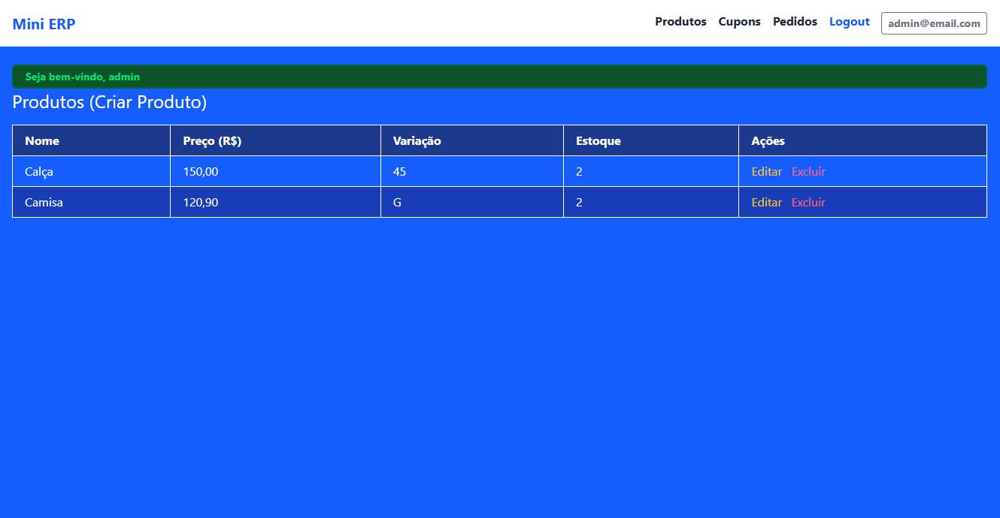
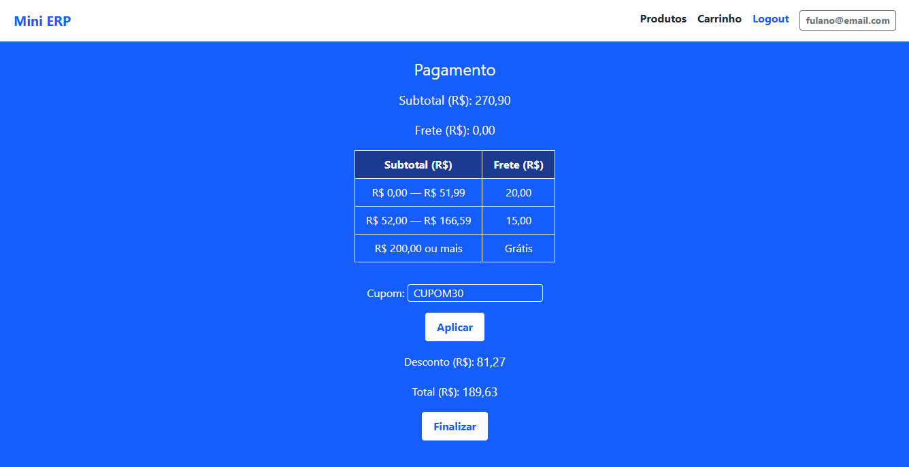

# Mini ERP

Mini ERP é uma aplicação simples de gerenciamento de pedidos, produtos, carrinho de compras e cupons. Desenvolvido em PHP puro com foco em funcionalidades básicas de um sistema de vendas.

---

## 📑 Índice

- [📷 Screenshots](#-screenshots)
- [⚙️ Tecnologias](#-tecnologias)
- [🚀 Instalação](#️-como-rodar-o-projeto)
- [🧩 Estrutura do Projeto](#-estrutura-do-projeto)
- [🧪 Funcionalidades](#-funcionalidades)
- [🔐 Segurança](#-segurança)
- [📬 Webhooks](#-webhooks)
- [📝 Licença](#-licença)

---

## 📷 Screenshots

### 📦 Tela de Produtos


### 🎟️ Tela de Adição de Cupons


---

## ⚙️ Tecnologias

- PHP 8.2
- MySQL 8.0
- Docker e Docker Compose
- PHPMailer
- Tailwind CSS
- HTML/JS Vanilla

---

## 🚀 Como rodar o projeto

### 1. Instale o Docker:

- [Guia para Windows](https://docs.docker.com/desktop/install/windows-install/)
- [Guia para Linux](https://docs.docker.com/engine/install/)
- [Guia para MacOS](https://docs.docker.com/desktop/install/mac-install/)

### 2. Clone o projeto:

```bash
git clone https://github.com/fernandofantinel/mini-erp.git
cd mini-erp
```

### 3. Rode o setup:

```bash
npm run setup
```

Esse comando:
- Sobe os containers Docker (`php`, `nginx`, `mysql`, e `node`);
- Executa as migrations;
- Compila os arquivos Tailwind CSS.

Acesse o sistema em: [http://localhost:8888](http://localhost:8888)

---

## 🧩 Estrutura do Projeto

```
.
├── app/
│   ├── Controllers/
│   ├── Models/
│   └── Views/
│       ├── buying/
│       ├── emails/
│       └── ...
├── Core/
├── public/
│   ├── index.php
│   ├── css/
│   └── js/
├── database/
├── Dockerfile
├── docker-compose.yml
└── .env
```

---

## 🧪 Funcionalidades

- Cadastro, edição e listagem de produtos
- Usuário admin(já cadastrado pelas migrations, senha 123) para gerenciamento de produtos e cupons.
- Usuários clientes para seleção de produtos, carrinho e etc.
- Carrinho de compras com controle de estoque
- Aplicação de cupons de desconto
- Checkout com cálculo de frete
- Envio de e-mail de e-mail de confirmação com PHPMailer
- Geração de pedidos
- Webhook para atualização e cancelamento de pedidos

---

## 🔐 Segurança

- Proteção das rotas com autenticação (usuário cliente não tem acesso as funcionalidades de admin)
- Tokens de cancelamento únicos nos pedidos
- Filtro e validação de entradas (ex: `filter_var`, `is_numeric`, etc)

---

## 📬 Webhooks

O sistema possui um webhook disponível na rota:

```http
POST /update-order
GET /cancel-order
```

Payload esperado:
```json
{
  "id": 70,
  "status": "cancelado"
}
```

- Se `status = cancelado` ou `status = pago`, o pedido será atualizado.

---

## 📝 Licença

Este projeto está sob a licença MIT.

---

> Última atualização: 2025-07-29
